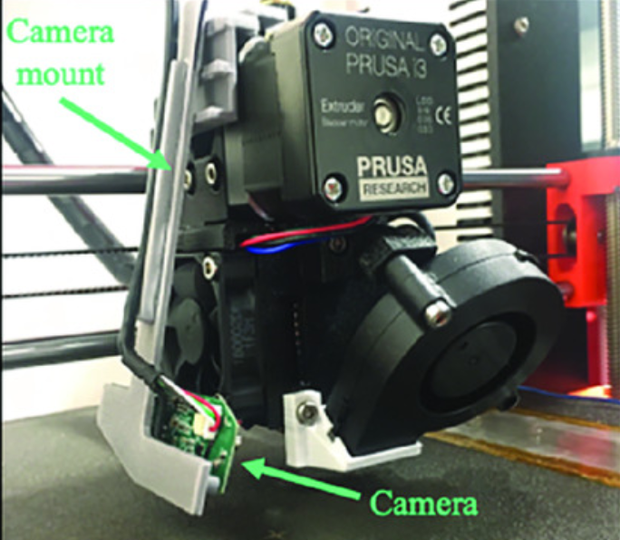
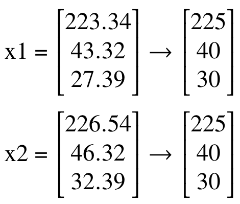
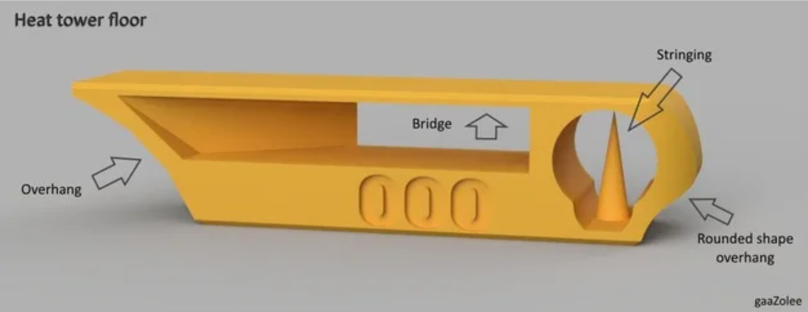
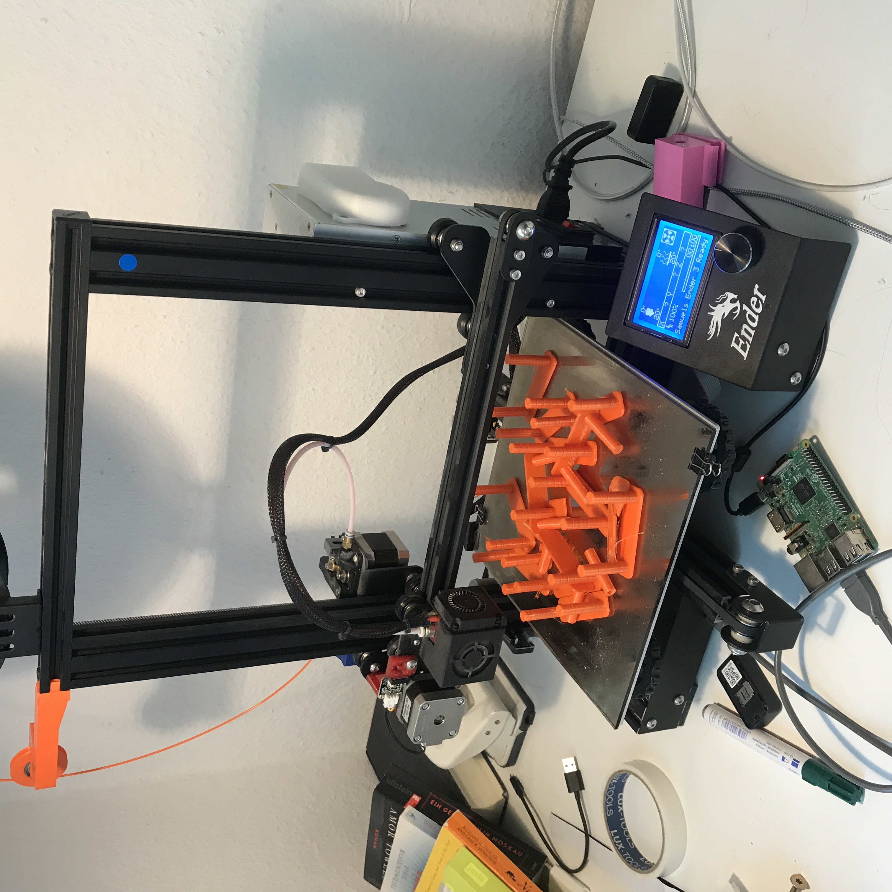

# read the PDF version [HERE](bachelor_thesis.pdf)


Calibrating print settings of low cost personal 3D printers is a key requirement to print objects with satisfactory quality. As of today, there exists no widely adopted automatic calibration of 3D print settings. In this paper, a semi-automatic calibration/optimization algorithm for 3D print settings has been developed. Semi-automatic because the users evaluation of test prints is required. While the resulting algorithm consistently comes close to the global optimum (the best print settings) in a simulated environment, the real world application is limited to non-existent.

3D Printing; Bayesian Optimization; Derivative Free Optimization; 3D Print Quality; FDM printer

Introduction
============

Within the last 15 years, multiple key patents regarding 3D printing, also called additive manufacturing (AM) expired . Simultaneously, research initiatives started developing low-cost 3D printers . The expiration of patents in combination with low-cost 3D printer initiatives influenced the recent re-emerge of interest around 3D printing and caused the upcoming of personal 3D printers . The focus of this paper are potentially disruptive personal 3D printers . Personal 3D printers refer to the low-cost 3D printers which emerged out of the research initiatives, predominantly bought by end-users in contrast to industrial scale 3D printers . Fused Deposition Modeling (FDM), is a type of 3D printing technology that prints objects layer-by-layer. Most personal 3D printers are FDM-based. Therefore, the focus of this paper are FDM-based personal 3D printers. While personal 3D printers are now capable of printing objects with satisfactory quality , the print quality highly depends on the chosen print settings . These print settings are configured and optimized manually. There exists no widely adopted automatic optimization or generation of optimal, or at least better, print settings. The current process can be illustrated as follows:

1.  Print an object.

2.  Inspect the printed objected and determine potential causes for print defects.

3.  Repeat steps 1 and 2 until the print quality is satisfying (enough).

The illustrated process requires tedious manual labor and can take multiple hours but is the current state of the art . Not only is that process a barrier in terms of ease-of-use for wider adoption of personal 3D printers , but, and more importantly, the resulting unoptimized print settings lead to low(er) print quality. Low print quality is one of the predominant reasons against wide mass adoption of personal 3D printers . The goal of this paper is the (semi-)automatic optimization of print settings for personal 3D printers in order to improve the print quality and by that potentially reduce the barrier for wider adoption.

Approach
========

The idea is to utilize a derivative-free optimization algorithm that iteratively selects print settings based on the user’s ranking of previous test prints. Ultimately, leading towards better print settings with each iteration. The requirement for the user to rank given print settings by their outcome is the reason why the paper has the compound word “semi-automatic” in its title. The user acts as the objective function which in turn leads to no “fully automatic” optimization because user interaction is required. Objective functions, sometimes referred to as black-box functions , return a numerical value based on given input parameters which is either min- or maximized. The returned value quantifies how good or bad given input parameters are . In the scope of this paper, the input parameters are the print settings and the output is the users ranking of the test print. The reason for relying on derivative-free algorithms is the fact that obtaining derivatives of the objective function with the proposed ranking approach is not possible. As the name suggests, derivative-free algorithms are suitable for optimization problems where obtaining the derivatives of the objective function is not possible or too computationally expensive . A ranking approach is chosen as opposed to a score-based approach to reduce expected noise. In simplified terms, noise describes a perceived change in the model (optimization process) although the perceived change is wrong. It is hard to impossible to quantify precisely (through a score e.g. from 1-10) how much better or worse a print’s quality is by looking at the object. On the contrary, it is possible to determine and numerically express (through a ranking) if an object is of better quality, or not, than another.

Evaluation of other Approaches
------------------------------

The reason for relying on the user’s judgment lays in the impossibility (to the author’s knowledge) of formulating an objective function using another metric without relying on computer vision or sensors. Both computer vision and sensors did not seem feasible during the time of writing which is further elaborated below. Generally, little research regarding the optimization of print settings in the scope of personal 3D printers has been found/conducted. A possible reason for the relatively sparse research might be explained by the relative “newness” of personal 3D printers and the niche market of hobbyists currently being served by the technology .

### Computer Vision

<span>r</span><span>0.45</span>  [figure/mountedCamera]

Initially, the utilization of computer vision was intended. A computer vision approach would enable more autonomous optimization, potentially in real-time. The idea was to mount a camera on top of the extruder, or attaching it onto the frame of the 3D printer. The camera, in combination with a classification model, would be used to detect print defects of a currently in-print object. Based on detected print defects, print settings could be adjusted accordingly. Multiple recently published papers utilized a camera to detect print defects and accomplished decent results, indicating that the general idea of utilizing a camera/computer vision is feasible in the context of classifying print defects . One team of researchers managed to automatically adjust the print setting that influences the detected defect in real-time , coming close to the idea of self-calibrating 3D printers, or at least a sort of automatic self-calibration. However, utilizing computer vision requires training data. Zeqing Jin et al. used 360.000 images in one of their research papers to train their models . Jin et al. likely used data augmentation to achieve such a high number of training images [1], and the constant feed of images (video) during a print likely also magnified the number of training images. Nevertheless, generating a training dataset requires lots of prints which is time-intensive. Paraskevoudis et al. developed a classification model with as few as 500 un-augmented images which can detect stringing, see figure [figure/stringing] for an example of stringing . But even generating 500 images was determined as too time-consuming for this project. The smallest test prints take at least 5-10 Minutes, more like 15-20 Minutes, and only test one or two very specific settings.

As promising as a computer vision approach is, the required amount of training data is too resource-intensive to obtain and ultimately led to the decision to not utilize computer vision.

### Sensors

Leveraging sensors which could act as an objective metric, or be used in a machine learning approach, did not seem promising at the time of writing. Currently, personal FDM 3D printers have a very sparse amount of sensors. The list includes the “position” of the stepper motors (X,Y,Z and the filament motor E), the extruder’s temperature (print temperature), print bed temperature (surface temperature) and fan speed. The print settings themselves are handled by slicing software. Slicing software converts 3D models into printable g-code. G-code is a numerical control language for manufacturing machines that has been adopted by the RepRap project and is used by the majority, if not all, personal 3D printers . The RepRap project was a research initiative to develop an open-source 3D printer that can print (replicate) itself and acted as “root” design for most low-cost personal 3D printers . Figure [figure/gcode<sub>e</sub>xample] (b) shows a g-code file containing instructions which results in the print of a 10mm x 10mm rectangle as illustrated to the left in figure [figure/gcode<sub>e</sub>xample] (a).

Simplified, g-code is just an instruction set that instructs the manufacturing machine, i.e. the 3D printer, to move the step motors X,Y,Z and the filament motor called E in a specific direction. Moving the axis X, Y, Z axis and simultaneously moving i.e. “pushing” or “retracting” filament with E leads to the printing of an object. In its simplicity lays the reason for the lack of sensors of 3D printers and why the g-code generation (slicing) is of more importance than the g-code itself. Different 3D printers printing the same g-code does not lead to the same print quality among all printers. Each 3D printer, and even filament, can require different print settings which are handled by the slicing software. It follows that the purpose of slicing software is not only the transformation of 3D models into g-code but generating “custom” g-code given a 3D model and a set of print settings.

In conclusion, using the printers step motor sensors X, Y, Z and E in combination with the g-code which would act as objective/truth-value did not seem promising because the printer prints the g-code correctly in most cases; but the g-code itself has not been optimized for the specific printer.

### Guided Local Search

The first developed approach to algorithmically optimize 3D print settings in the context of this paper was a local search algorithm inspired by current state-of-the-art manual optimization of retraction settings . Retraction settings determine how much filament is “retracted” just before the print head moves to another point without extruding plastic on its way. If the retraction is too low, stringing can occur. If the retraction is too high, gaps in the surface can occur. An illustration of stringing is shown in figure [figure/stringing]. The user was required to print a tower-like object which was split into different segments. Each segment was printed with different retraction settings whereas the set of all segments act as the range of a specific setting. After each print, the user was prompted to define the two best segments. The algorithm then returned a new test object whereas the print settings of each segment lay within the range of the previous two best segments. Figure [figure/local<sub>s</sub>earch<sub>i</sub>llustration] illustrates one iteration with further explanation.

The approach replicated manual optimization more algorithmically. Thus, it inherited the same shortcoming: Simultaneous multivariable optimization is not possible or takes too many iterations which is crucial considering the print time and manual labor required for each iteration. Simultaneous refers to optimizing multiple variables at once instead of optimizing “one variable after another”. Because of the lack of simultaneous multivariable optimization, the approach was not further developed but might offer value to users due to the more algorithmic “manual” optimization.

 [figure/gcode<sub>e</sub>xample]

[b]<span>0.4</span>  [figure/local<sub>s</sub>earch<sub>i</sub>llustration]

[b]<span>0.45</span> ![A typical stringing test object which has stringing in the upper part of the object. Stringing can occur if the retraction distance is not optimal. Each time the print head “travels” from one point to another, plastic must not be extruded. However, not extruding plastic is not enough. The plastic needs to be retracted from the nozzle right before starting the start of the “travel” and pushed back into the nozzle once arrived. If the retraction distance is too low, the plastic in the nozzle keeps “sticking” to the object. When the print head now starts moving, the sticking plastic creates strings. Similar to melted cheese on a pizza.](assets/stringing.jpg "fig:") [figure/stringing]

Implementation
==============

Multiple popular derivative-free algorithms suited for specific scenarios exist . The requirements for this scenario were determined as follows:

1.  **The optimization problem is discrete.** A 3D printer’s accuracy is limited and thus discrete. For example, the print temperature might be set to 221.20348129344C but 3D printers are not capable of printing such fine-grained settings. Even though a print temperature of 221.20348129344C might be set, a printer would print with 221C.

2.  **The optimization problem has constraints.** Print settings have known constraints in which the optimum lays. Testing a print temperature below 150C is unnecessary. The plastic will not reach the melting point and thus can not be printed. Similarly, a print temperature above 250C will lead to worse quality.

3.  **A surrogate model-based optimizer is required.** How “good” or “bad” certain print settings are can only be observed through the users ranking of previous prints and can not be measured directly. A surrogate-based optimizer approximates the objective of better print settings, not to confuse with the objective function which is the user’s ranking, through previously observed evaluations (test prints). The key difference to non-surrogate optimizers is the fact that the choices of observations are optimized, not the evaluation itself. In the context of this paper: The choice of which print settings to test next is optimized, not the objective of better print settings itself. But by optimizing the choices, “good” print settings can be approximated . One can think of surrogate-based optimizers as optimizers that make informed guesses (choices) where the optimum (good print settings) might lie.

4.  **The optimizer needs to yield results with as few evaluations as possible.** This optimization problem’s bottleneck is printing time and required manual labor. Each evaluation takes at least 10 minutes, dependent on the test object. It follows that as little as 6 evaluations easily take one hour to proceed while additionally requiring manual labor to set up each evaluation print.

Requirements 3 and 4 go hand in hand. Surrogate models, also known as approximation models, are mainly used to reduce the number of evaluations of an objective function . Therefore, the choice for the optimization algorithm boils down to a surrogate-based optimizer that can optimize constrained discrete parameters. One of the investigated optimization algorithms was Bayesian optimization. Bayesian optimization utilizes a Gaussian process that provides a probability distribution as a surrogate model for the objective (of better print settings) in combination with an acquisition function . The purpose of the acquisition function is to determine which values to sample next i.e. which print settings to test next based on the probability distribution. The acquisition functions exploration and exploitation trade-off can be influenced through the hyperparameters xi \(\xi\) and kappa \(\kappa\) . \(\xi\), \(\kappa\) and the choice of the acquisition function itself modify the probability distribution which in turn adjusts the exploration and exploitation behaviour of the optimizer . After each evaluation (test print), the probability distribution is updated to account for the new evaluation . The process is repeated for a specified amount of epochs. Figure [figure/bayesian<sub>o</sub>ptimization<sub>i</sub>llustration] illustrates the process of Bayesian optimization. While Bayesian optimization is of continuous nature, since the underlying probability distribution is continuous, recent research has found Bayesian optimization to perform well on discrete problems as well, even outperforming state-of-the-art discrete optimization algorithms . Initial tests have shown that Bayesian optimization approximates optimal print settings in a simulated environment relatively fast and consistently. Furthermore, in comparison to other algorithms, an excellent Python package from Fernando Nogueira that implements the algorithm with an extendable API exists . Because of the promising initial tests compared to other optimization algorithms [2], the recent research indicating that Bayesian optimization outperforms dedicated discrete optimizers and the available Python package, bayesian optimization has been chosen as the optimization algorithm for this project.

[!htb] ![An exemplary Bayesian optimization process. Iteration 0 is the start of the process where one point has been evaluated at \(x\approx0.5\). The acquisition function’s maximum is at \(x\approx2.2\). Therefore, in the next iteration (iteration 1), the evaluated point is \(x\approx2.2\). After the evaluation of \(x\approx2.2\) the probability distribution is updated and the next point, as determined by the acquisition function, is evaluated. The plots show how Bayesian optimization improves the approximation of the objective with each iteration. The objective is shown as *Ground Truth* in the plots, while the approximation is shown as *Predicted*. The plots were taken from Agnihotri & Batra, “Exploring Bayesian Optimization”, Distill, 2020 .](assets/bayesian_optimization_illustration.png "fig:") [figure/bayesian<sub>o</sub>ptimization<sub>i</sub>llustration]

Adjusting Bayesian Optimization for Discrete Values
---------------------------------------------------

Although Bayesian optimization can work with discrete values, the implementation from Fernando Nogueira does not support discrete values . Fernando Nogueira himself proposed a simple float to integer cast in the GitHub repository which is in line with other research . The question arises where to cast or round to an integer within the implementation. Garrido-Merchán et al. suggest three approaches :

1.  Within the step e.g. which point to sample next.

2.  Within the objective function.

3.  Inside the Gaussian process.

Modifying the Gaussian process performed best in the experiments conducted by Garrido-Merchán et al. . However, that observation was influenced by the fact that hyper-parameter tuning was deemed too expensive. Without appropriate hyper-parameters, the first approach, which is easier to implement, might result in the convergence process “getting stuck” in a local optimum . But, hyper-parameter tuning is easily conducted in this project using a simulated environment that avoids real prints. Without real test prints, the optimization problem becomes “cheap” (time-wise, computationally it is cheap regardless of a simulated environment or not), allowing for exhaustive automated hyper-parameter tuning, diminishing the downside of approach 1 while keeping the benefit of easier integration. The second approach of casting or rounding continuous values to a discrete value within the objective function is easiest to implement but tests have shown that the approach did not work in combination with the following improvement developed during testing:

To further reduce the number of evaluations, and by that improve upon requirement 4, the probes are binned to defined step sizes. Binning refers to grouping a set of numbers “together”. For example, no notable difference between one-degree print temperature e.g. 205C and 206C is visible.

<span>r</span><span>0.44</span>  [figure/casting<sub>b</sub>inning<sub>m</sub>atrices]

Therefore, suggesting unnoticeable differences and by that “wasting” evaluations is reduced by defining step sizes for print settings. Each sample that the acquisition function then chooses is “binned” to the closed step size. Print temperatures might be binned as following: The step size is set to 5C. The optimizer then probes temperatures in the given constraints e.g. 180C to 220C which could yield 186.21C. The binning process then rounds 186.21to the closet value of the defined step size of 5 which results in 185C. In the given example, binning reduces the number of probable temperature settings by a factor of 5 from 40 to 8. The drastic reduction of probable settings came with a downside: testing revealed that although the optimizer yielded results much faster, the optimizer oftentimes “got stuck” probing different points which are binned to the same point. Figure [figure/casting<sub>b</sub>inning<sub>m</sub>atrices] shows an illustration of the problem binning can entail. To solve the problem, temporarily adjusting the optimizer’s hyper-parameters \(\xi\) and \(\kappa\) to increase exploration, if the current probe is identical to an already probed point, has been tested. Unfortunately, the method has been found to have a neglectable effect. Since the alternative of stopping the optimization process upon sampling an identical probe has led to unoptimized print settings, an alternative to dynamically adjusting the exploration of the optimizer had to be found. The solution was simple: If a newly sampled probe is identical to an already probed sample, sample a new random probe until the obtained random sample is not identical to an already probed sample.

Coming back to why the second approach did not work: Due to binning, casting/rounding within the objective function lead the optimization process to “get stuck”, regardless of the random sampling solution. Reason being that the binned probed points are internally saved as unbinned continuous probes. With each step, the acquisition function takes the unbinned probes into account to sample a new probe. But the differences between the unbinned and evaluated probes vastly differ, unbeknown to the optimizer. Ultimately, modifying the sampling method (approach 1) has been chosen because it was easier to implement compared to modifying the Gaussian process and worked with binning.

Simulation and Hyperparameter Tuning
------------------------------------

The convergence of Bayesian optimization depends on the chosen acquisition function and the functions hyper-parameters . Since this optimizations problems bottle-neck is the time it takes to print test objects and not computational resources, a simulated environment has been developed which allows for cheap(er) hyper-parameter tuning.

### Print Settings of Focus (The Parameters)

Theoretically, the chosen and modified bayesian optimization algorithm should be able to optimize any print setting, as long as visible differences for the to-be-optimized print setting are visible to the user during the evaluation/ranking step. However, the simulation, and later the evaluation of the implementation is conducted focusing on print settings that have been identified as over-proportionally influential and simultaneously relatively fast testable with a specific object . The parameters, including their constraints and step size, given as (lower bound, higher bound, step size), are:

1.  **Print Temperature *in C* (180, 220, 5):** Determines the extrusion temperature i.e. at which temperature the plastic should be extruded. If the temperature is too low, layers do not stick together. If the temperature is too high, the viscosity of the extruded plastic is too low leading to diminishing print quality.

2.  **Retraction Distance *in mm* (2, 8, 1):** An illustration and detailed explanation is given in figure [figure/stringing].

3.  **Flow Rate *in %* (90, 110, 2):** Determines how much plastic should be extruded. Extruding not enough plastic leads to under-extrusion that is visible by gaps in the object. Extruding too much plastic results in over-extrusion visible by surface defects such as blobs. Figure [figure/extrusion<sub>e</sub>xample] shown an illustration of under- and over-extrusion.

*The constraints, step sizes and description have been defined or chosen through multiple years of experience and various online resources such as .*

 [figure/extrusion<sub>e</sub>xample]

### Loss Function

To simulate an optimization process, the objective function i.e. the ranking of print settings needs to be simulated. And to simulate the ranking of print settings, a loss function determining how “good” or “bad” given print settings (parameters) are, had to be developed. The developed loss function sums the absolute distance of each given parameter to a truth value divided by the parameters step size. The division by the parameters step sizes adjusts potential weight imbalances between parameters with different step sizes. Lastly, the sum is multiplied by -1 since the optimizer is maximizing. The result is a loss function that sums each of the parameter’s deviation from the truth value under consideration of the step size by -1. A concrete example loss calculation is shown in figure [figure:loss<sub>f</sub>unction<sub>e</sub>xample] and pseudocode of the implementation in figure [figure/loss<sub>f</sub>unction<sub>p</sub>seudocode].

``` {.javascript}
    function loss(parameters, step_sizes, truth_value):
        results = empty list
        for index in length(parameters):
            calculation = absolute((truth_value[i] - parameters[i]) / step_sizes[i])
            results.add(calculation)
        return -1 * sum(results)
    
```

[figure/loss<sub>f</sub>unction<sub>p</sub>seudocode]

\[parameters =  \begin{bmatrix}
    210 \\
    5 \\
    30 
    \end{bmatrix}, 
    truth values = \begin{bmatrix}
    215 \\
    3 \\
    50 
    \end{bmatrix},
    step sizes = \begin{bmatrix}
    5 \\
    1 \\
    10 
    \end{bmatrix}\]

\[\begin{aligned}
    &=  abs(\begin{bmatrix}
    210 \\
    5 \\
    30 
    \end{bmatrix} -
    \begin{bmatrix}
    215 \\
    3 \\
    50 
    \end{bmatrix}) \div
    \begin{bmatrix}
    5 \\
    1 \\
    10 
    \end{bmatrix} \\
    &= \begin{bmatrix}
    5 \\
    2 \\
    20 
    \end{bmatrix} \div \begin{bmatrix}
    5 \\
    1 \\
    10 
    \end{bmatrix} \\
    &= sum(\begin{bmatrix}
    1 \\
    2 \\
    2 
    \end{bmatrix}) \\
    &= -1 * 5 \\
    &= -5
    \end{aligned}\]

[figure:loss<sub>f</sub>unction<sub>e</sub>xample]

### User Ranking (The Objective Function)

The ranking process is straightforward: The better the print, the higher its rank. After each print, the user is asked to determine the rank of the new print. The process might look as following: The user has printed 3 test objects, each with different print settings, which are stacked on top of each other. The bottom print has the rank 0, the middle print rank 1, and the upper print rank 2. A new test print might be ranked as 2. In that case, the new print is inserted below the upper print in the stack. After each ranking, the optimizer is re-initialized to take the new and adjusted ranks into account.

The simulation of the user ranking is also straightforward: Instead of asking a user to rank the print, the loss of a print, as returned by the loss function, determines its rank.

### Simulated Optimization Process

The hyperparameters to optimize are the choice of the acquisition function, kappa \(\kappa\) and xi \(\xi\). For all of the following simulations, the number of epochs has been set to 18 plus 2 for the initial probes. Expecting a user to print more than 20 test prints seems unreasonable. Furthermore, in each run, a random truth value is generated to simulate different printers which are assumed to have different optimal print settings. It is important to note that the random truth value does account for the constraints but does not account for the step sizes. Thus, the truth value might be “unreachable” for the optimizer given certain step sizes. For example, the truth value for the print temperature might randomly be chosen as 203. If the step size of the print temperature is defined to be 5, then the optimizer can only probe 200 or 205 but not 203. For the simulation, this effect was determined to be not harmful and likely resembles real application. One run is defined as one optimization process which in itself has 18 plus 2 epochs. Thus, 10 runs lead to the generation of 10 different truth values which the optimizer is set to optimize in 18 plus 2 epochs.

One of the solutions tested in response to the earlier mentioned binning problem was to statically set the first two probes as lower- and higher bound of the determined constraints. An example: The constraints are set as lower bound: (190,5,20) and higher bound (220,10,60). The first two probed points are then [190,5,20] and [220,10,60]. Although the binning problem was solved using random sampling, the effects of static or random initial probes have been tested. The results revealed that both the median and mean loss are lower, thus better, using random initial probes. To reduce the time complexity of further simulations, random initial probes are used and further evaluation of static initial probes has been omitted.

Afterwards, a simulation has been conducted to determine which acquisition function could be excluded from further simulations and to narrow the range of tested \(\xi\) and \(\kappa\) parameters. Reason being that although this optimization problem is computationally cheap(er), performing naive hyperparameter tuning by simulating all possible combinations results in bad time complexity and therefore long running time. The range of \(\kappa\) has been set to 0 to 10 with a step size of 1. The range of \(\xi\) been set to 0 to 1 with a step size of 0.1. Both the \(\kappa\) and \(\xi\) range has been set in accordance with explanations provided by Nogueira . Each unique combination of the hyperparameters has been simulated 10 times. The result is shown in figure [figure/experiment2]. Across all acquisition functions, the mean loss was higher than -2. Remember that 0 is the absolute best the optimizer can achieve whereas -2 means the optimizer is two-step sizes away from the optimal solution. Regardless, the Expected Improvement (ei) acquisition function slightly outperformed the other acquisition functions and has therefore solely been selected for simulation runs. Furthermore, the optimal \(\kappa\) value seems to lay in between 1 and 4 while the optimal \(\xi\) value seems to lay above 0.5 potentially exceeding the set bound of 1.

[figure/experiment2]

One last simulation has been conducted to determine the optimal \(\kappa\) and \(\xi\) value for the Expected Improvement acquisition function. The range of \(\kappa\) has been further narrowed from 0 to 10 *to* 1 to 6 while the range of \(\xi\) has been been shifted from 0 to 1 *to* 0.5 to 1.5. The reduced computing time caused by lowering the number of acquisition functions and narrowing the \(\kappa\) value was used to increase the number of runs per rotation from 10 to 100. The increased number of runs should reduce the influence of the randomized initial points and random samples caused by the binning process. All runs had a mean loss higher than -2. In contrast to the previous simulations, the median of the number of epochs until the best solution has been found was evaluated besides the mean loss of the best solution. Reason being, the earlier the optimizer finds the best solution, the fewer prints have to be conducted. Figure [figure/simulation3] shows a subset of the results. Based on the result, the optimal hyperparameters have been chosen as the Expected Improvement acquisition function with \(\kappa\) = 1 and \(\xi\) = 0.7.

<span>rrrr</span> kappa & xi & median epochs until best solution & mean loss
1 & 0.7 & 13.0 & -0.973
3 & 1.1 & 13.0 & -1.009
2 & 1.2 & 15.0 & -1.027
1 & 0.8 & 13.0 & -1.055
2 & 0.6 & 14.0 & -1.058

[figure/simulation3]

Result
======

Simulated Environment
---------------------

Figure [figure/convergence] illustrates the convergence in one optimization run with the optimal hyperparameters. A mean loss of approximately -1 in an environment where the optimizer might not even be able to find the best solution seemed promising. To validate the observation, the simulation has been modified to only sample randomly. The results indicated that the previously observed low mean losses might not be that impressive. In an exemplary simulation, random sampling yielded a loss of -2.679 over 100 runs. Which is worse than sampling with the developed Bayesian optimization algorithm, but not too far off. Increasing the amount of to-optimize parameters from 3 to 5 was anticipated to yield a starker difference between the developed algorithm and random sampling. However, the results were similar to previous comparisons: The Bayesian optimization algorithm was better than random sampling but only by a small margin. To conclude the results of the simulation: The developed optimization algorithm comes consistently close to the optimal solution in a simulated environment, but the performance might not be much better than random sampling.

![(A) and (b) show the convergence process of the implementation in one particular run in which the truth value has been defined as (215 print temperature, 4 retraction distance, 98 flow rate). Figure (a) shows all probes points and their loss. The dot marked with the purple outline and purple dotted lines is the truth value while the dot marked with a blue outline and blue dotted lines is the point determined to be the best after the optimization process. Figure (b) shows the loss in each epoch (of each probed point in order) and the best known point so far of the same optimization process.](assets/convergence_both.png "fig:") [figure/convergence]

Real-World Evaluation
---------------------

The printer used for real-world evaluation was a Creality Ender 3, one of the most recommended and sold 3D printers with a price tag that’s below \$250 . The printer has been upgraded with a glass print bed and motor silencers. None of which are expected to influence the the evaluation in a meaning-full manner. PLA has been used as filament as it is the most used material for 3D printing . The selected test object is the “Smart compact temperature calibration tower” from Zolee Gaa . The object has been chosen since it tests multiple test patterns at once, namely overhangs, bridges, stringing and curvy shapes, in about 19 minutes per test print. Figure [figure/smartCalibrationTowerSegment] shows the object.

The result was two-folded: First, the fact of just printing test objects without thinking what settings could or should be changed next is convenient, so much so that even the long time it took to finish one optimization process (roughly 6 hours / 15 test prints) was not too problematic. But, the improvement was diminishing small. Too small to justify 6 hour long optimization processes. The improvement might be higher, the more variables are optimized. However, each added variable is expected to lengthen the optimization process disproportionately which has been shown in the evaluation of the simulation.

 [figure/smartCalibrationTowerSegment]

Conclusion
==========

The developed optimization algorithm comes close to the optimal solution in a simulated environment. However, under real circumstances, the optimization process takes too long for too little visible improvement. One optimization process (≈15 test prints) easily takes 6 hours. Using standard, or community optimized, 3D print settings and optimize one specific print setting that is evaluated by detected print defects (defect gets less/more severe) or special tests like instead of optimizing multiple print settings simultaneously yields visible results faster. Therefore, the real-world application of the developed optimization algorithm, in its current form, is determined to be little to non-existent.

Further research should subsequently focus on reducing the real-world optimization time. One solution could be a “lock” mechanism. If a print temperature of 205C has been identified as optimal, no further print settings should be probed with a temperature other than 205C; slowly reducing the amount of in-optimization print settings. Another solution could be to probe settings in batches and print test towers objects, as seen in figure [figure/stringing], instead of printing probed print settings “one by one”. The amount of manual labour and time between each print is reduced by a lower amount of total prints. However, probing settings in batches could have a negative impact on the optimization process itself. Utilizing computer vision seems more promising in the context of too-long real-world optimization processes. Print defects could be detected in real-time, as some researchers already have done . Detecting and acting upon print defects in real-time could drastically lower the duration of an optimization process.

Regardless, the limiting factor of real-world application might not be the optimization time alone. The optimization of a small subset of print settings did not lead to an order of improvement as anticipated and might have been a “dead end” from the start. A computer vision approach would have likely stumbled upon the same limitation. Although the detection of print defects in real-time through computer vision could be of enough value since a user, or the machine could interrupt an ongoing 3D print, reducing the amount of filament and time wasted on a defectious object. The tool Spaghetti Detective does just that with a very specific print defect and has tremendous success . Furthermore, the print quality of personal FDM 3D printers might not be substantially improvable with software alone. Focusing upon improving the hardware of personal 3D printers, likely in combination with software, seems more promising. Development and adoption of entirely new print techniques are already on their way. While FDM-based personal 3D printers have been the subject of this paper, Resin-based 3D printers have become popular and cheap within the last two years. Resin 3D printers do not print an object layer by layer. They utilize light in the form of a laser or LCD screen. The advantages are fewer moving parts and unmatched print quality. The downsides are (even) longer printing times, the use of toxic chemicals and the requirement to clean the 3D printer after each print. However, if Resin-based, or other technologies, overcome their current downsides, FDM-based personal 3D printers might be replaced as “the standard personal 3D printer technology” and with its replacement, the problem of low quality 3D prints, influenced by none optimal print settings, might become a relict of the past.

Appendix
========

[!htb]  [appendix/enderPrinter]

[1] Data augmentation refers to a set of techniques that modify images in such a way that the modified images are perceived as different images by a machine learning algorithm compared to the original images . The result is a cheap method to artificially increase the number of images in a dataset.

[2] The compared-to algorithms were mostly from the Nevergrad package. Nevergrad is a Python package developed by Facebook Research that labels itself as a gradient-free optimization platform . The appeal of the package is bundling multiple optimization algorithms in one package, all wrapped with a single API. The single API makes testing of different algorithms with little duplicated, or adjusted, code possible.
